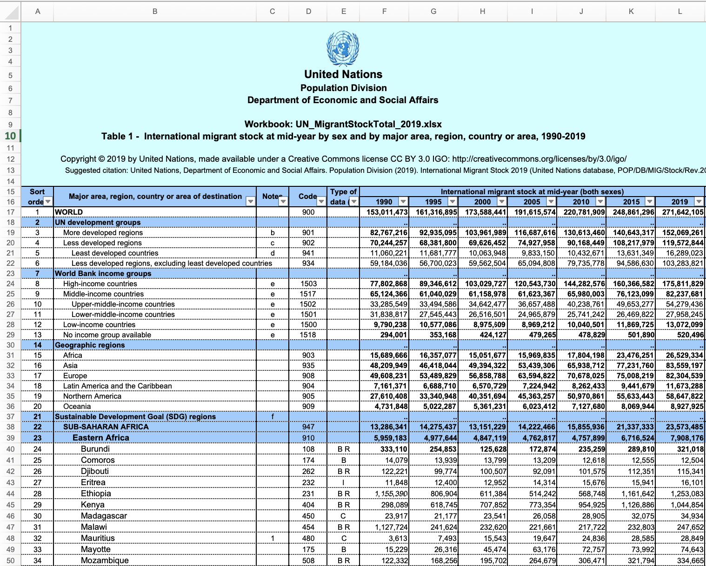

# Introduction

Given the extraordinary surge in migration during the recent years, it is interesting to find out if there is a particular change in the demographics of those groups. The data presented here does not account for refugees or population outflows, but it does provide the opportunity to explore some macro trends of migration, which in this case will be gender.

The guiding research questions is: **Is there convincing evidence that the world has seen a change in its gender proportion of migrants between 1990 and 2019?**

In order to address this question, we postulate the following hypothesis:

\[Ho: The \ gender \ proportion \ has \ not\ changed\ (p_{1990} = p_{2019} \rightarrow p_{2019} - p_{1990}=0 \rightarrow p_{diff} = 0) \]
\[Ha: The \ gender \ proportion \ has \ changed\ (p_{1990} \neq p_{2019} \rightarrow p_{2019} - p_{1990}\neq0 \rightarrow p_{diff} \neq 0) \]

## Environment Setup

Load required libraries
```{r message=FALSE, warning=FALSE}
library(tidyverse) #readr, dplyr, tidyr, stringr, tibble, ggplot2
library(knitr)
library(kableExtra)
library(readxl)
library(scales)
library(countrycode)
```

A helper function for displaying tables
```{r}
showtable <- function(data, title) {
  kable(data, caption = title) %>%
  kable_styling(bootstrap_options = c("striped", "hover", "condensed"))
}
```

# Data

## Data Description

We are looking at data collected by the United Nations found [here](https://www.un.org/en/development/desa/population/migration/data/estimates2/data/UN_MigrantStockTotal_2019.xlsx).

In particular, we are looking at Table 1.

The data is collected by the United Nations and the estimates are based on official statistics of foreign-born populations. The data is collected every year, but only 5 year increments as well as the current year (2019) are given.

Each case represents an estimate of a country's international migrant population by gender, for a particular country and year. There are 3216 observations in the data set. 

The response variable is the count of migrant population which is discrete and numerical. We will boil it down into the gender proportion of migrants which is continuous and bounded between 0 and 1.

The independent variables are `Year` which is a quantitative discretization of time and `Gender` which is qualitative. We should note that Year can be a different type of variable depending on how it is used. While in this context it makes sense to think of it as numerical time series, it does not make sense to apply numerical operations to it like for example to taking the average of two years or adding two years.

This study is observational because the data collectors had no control over the variables. 

Regarding generalizability, the collected data represents the entire population of migrants so there was no random sampling. However, we will be randomly sampling the data to be able to generalize. In this study there is notion of causality since there is no random assignment. 

## Data Import

The document consists of multiple tabs of data. We will focus on Table 1 which contains International migrant stock at mid-year by sex and by major area, region, country or area, 1990-2019. We will look at the non-aggregated data for each country for both males and females to see what trends we can derive from this dataset.

```{r message=FALSE, warning=FALSE}
untidy <- read_xlsx("UN_MigrantStockTotal_2019.xlsx", sheet = "Table 1")
```

Here is a quick look at the data. There are rows for every country as well as for aggregations by region. We can only find data by year and gender for the range 1990-2019.




## Data Transormation/Preparation

We start by selecting the rows and columns of interest. We will ignore the aggregated data and select the country rows and the and the migrant stock data for the individual sexes

```{r message=FALSE, warning=FALSE}
# Select the rows and columns of interest.
clean <- untidy %>% 
  select(2,`United Nations`,13:26) %>% 
  slice(33:294) %>% 
  filter(!is.na(`United Nations`)) %>% 
  select(-`United Nations`)
```

```{r}
years <- untidy %>% 
  select(2, 13:26) %>% 
  slice(11)
```

```{r}
# rename columns
names(clean) <- as.character(years)
names(clean)[1] <- "Country"
```

```{r message=FALSE, warning=FALSE}
# transform the data into long format
cleaner_m <- clean[1:8]
cleaner_f <- clean[c(1,9:15)]
tidy_m <- cleaner_m %>% 
  gather("1990":"2019", key = Year, value = MigrantCount) %>%  
  mutate(Sex = "Male")
tidy_f <- cleaner_f %>% 
  gather("1990":"2019", key = Year, value = MigrantCount) %>%  
  mutate(Sex = "Female")
migrants <- rbind(tidy_m, tidy_f)
migrants["MigrantCount"] <- apply(migrants["MigrantCount"], 2, function(x) as.numeric(x))
migrants <- drop_na(migrants)
```

Let's take a look at 15 random oberservations from this tidy data table.
```{r}
showtable(sample_n(migrants, 10),"Long Format")
```

```{r}
migrants_wide <- migrants %>% spread(Year, MigrantCount)
showtable(sample_n(migrants_wide, 10),"Wide Format")
```

We perform a series of transformations for downstream analysis.

```{r}
grouped_total <- migrants %>% 
  group_by(Year, Sex)  %>% 
  summarize(Total=sum(MigrantCount)) %>% 
  mutate("Total_m" = round(Total/1000000,1))
```

```{r}
proportions_by_year <- grouped_total %>% 
  select(-Total_m) %>%
  spread(Sex, Total) %>% 
  mutate(Total = Female + Male, Female = round(Female/Total,4), Male = round(Male/Total,4))  %>%
  select(Year, Female, Male) %>%
  gather("Female":"Male", key = Sex, value = Proportion)
```

```{r}
showtable(proportions_by_year, "")
```


```{r}
diff <- migrants %>% 
  spread(Sex, MigrantCount) %>%
  select(1:2, Male, Female) %>%
  mutate(Delta = Male - Female, Delta_m = Delta/1000000, Total = round(Male + Female,4), Prop = round(Male/Total,4)) 
```

```{r}
showtable(sample_n(diff, 10),"")
```

Here we randomly sample around 9% of the observations that we will use in our statistical analysis. We choose 9% to respect the condition for inference stated below. The two following tables show an example of the randomly selected countries for 1990 and 2019.

```{r}
set.seed(606)
# determine number of observations
n <- length(clean$Country)
# sample 9%
y1990 <- diff %>% filter(Year == "1990") %>% sample_n(round(0.09*n))
y2019 <- diff %>% filter(Year == "2019") %>% sample_n(round(0.09*n))
```

```{r}
showtable(y1990, "Sampled Data for 1990")
```

```{r}
showtable(y2019, "Sampled Data for 2019")
```

# Exploratory Data Analysis

## Population

The following analysis is based on the true population data.

Below is a summary of the data. We see in particular that the greatest net positive of female migrants was ~1.7m while it is nearly 4.9m for men. In terms of proportion, the parameter of interest (proportion of males) was as high as 87% and as low as 29%. The summary statistics just stated are from all observations, meaning here that these numbers are individual observations so they could be from any country or any year.

```{r}
summary(diff)
```

The plots below reveals that the total population of migrants is increasing over time. We notice that the difference between the number of male and female migrants is increasing. Also shown is the change in the gender proportion over time. 

```{r echo=FALSE}
ggplot(grouped_total, aes(x=Year, y=Total_m, group=Sex)) +
  geom_line(linetype="dashed", aes(color=Sex)) +
  geom_point(aes(color=Sex)) +
  geom_text(aes(label=Total_m), vjust=-1, size=2) +
  theme(legend.position="top") +
  ggtitle("Migrant Populations by Year and Sex") +
  ylab("Total Migrants (in millions)")
```

Here we see how the difference between male and female migrant population is dsitributed over time. We can identify the max and min observations from the summary above in 2019.

```{r echo=FALSE}
ggplot(diff, aes(Year, Delta_m)) + geom_jitter(width = 0.25, alpha = 0.5) +
  ggtitle("Net Male Migrant Population Distribution") +
  ylab("Net Male Migrant Difference (in millions)")
```

As seen below, there is averall increase in the proportion of male migrants.

```{r echo=FALSE}
ggplot(proportions_by_year, aes(x=Year, y=Proportion, group=Sex)) +
  geom_line(linetype="dashed", aes(color=Sex)) +
  geom_point(aes(color=Sex)) +
  theme(legend.position="top") +
  scale_y_continuous(labels = percent) +
  ggtitle("Migrant Proportions by Year and Sex")
```

The side-by-side plot shown below looks at the cases of interest for the statistical study.
```{r echo=FALSE}
pop1990 <- proportions_by_year %>% filter(Year == 1990)
pop2019 <- proportions_by_year %>% filter(Year == 2019)
pop <- proportions_by_year %>% filter(Year == 1990 | Year == 2019)
```
```{r}
ggplot(pop, aes(Sex, Proportion)) + geom_bar(stat="identity") + facet_wrap(~Year) +
  geom_text(aes(label=Proportion), vjust=-1, size=3) +
  ggtitle("Migrant Gender Proportions from True Population 1990:2019")
```


By looking at the population data, we can say that there has been an increase in the number of male migrants relative to females.

## Sampled Data

This side-by-side plot below shows the proportions from the sampled data. We observe very minor change from 1990 to 2019.

```{r echo=FALSE}
p1990 <- round(sum(y1990$Male)/(sum(y1990$Male)+sum(y1990$Female)),4)
p2019 <- round(sum(y2019$Male)/(sum(y2019$Male)+sum(y2019$Female)),4)
p <- data.frame(Year = c(1990,1990,2019,2019),
                Sex = c("Male", "Female","Male", "Female"),
                Proportion = c(p1990,1-p1990,p2019,1-p2019))
```

```{r}
summary(y1990)
```

```{r}
summary(y2019)
```

```{r echo=FALSE}
ggplot(p, aes(Sex, Proportion)) + geom_bar(stat="identity") + facet_wrap(~Year) +
  geom_text(aes(label=Proportion), vjust=-0.5, size=3) +
  ggtitle("Migrant Gender Proportions from Sampled Countries 1990:2019") 
```

# Inference

## Methodology

The distribution of the sample proportion is described by the following:

$\hat{p} \sim N \left( mean = p, SE = \sqrt{\frac{p(1-p)}{n}} \right)$

The confidence interval is described by the following:

$confidence\ interval =  \hat{p} \pm z*SE$

In this study, we will be using a 95% significance level.

Since we are looking at the distribution of the difference of two independent sample proportions the standard error takes the following form:

$SE_{(\hat{p}_1 - \hat{p}_2)} = \sqrt{\frac{ \hat{p}_1 (1 - \hat{p}_1)}{n_1} + \frac{ \hat{p}_2 (1 - \hat{p}_2)}{n_2} }$

## Conditions

We then verify the conditions for inference on proportions.

1. Individual observations should be independent (the sample size should be < 10% of the population if sampling without replacement)

This condition is respected as we sampled 9% of the population.

2. The sample distribution should be approximately normal.

We are on the border of acceptable with the check below:

$np = 21 \times 0.5 = 10.5 > 10$  
$n(1-p) = 21 \times 0.5 = 10.5 > 10$

3. Randomness: the data must come from a random sample or a randomized experiment

The data was randomly sampled.

## Confidence Intervals

To determine is there is a statistical significance in the different of proportions, we study the overlap of the confidence intervals for the years of interest.

```{r}
# year 1990
total1990 <- sum(y1990$Male) + sum(y1990$Female)
p1990 <- sum(y1990$Male) / total1990
se1990 <- sqrt((p1990*(1-p1990))/total1990)
me1990 <- qnorm(0.975) * se1990
ci1990 <- c(p1990-me1990,p1990+me1990)
```

```{r}
# year 2019
total2019 <- sum(y2019$Male) + sum(y2019$Female)
p2019 <- sum(y2019$Male) / total2019
se2019 <- sqrt((p2019*(1-p2019))/total2019)
me2019 <- qnorm(0.975) * se2019
ci2019 <- c(p2019-me2019,p2019+me2019)
```

Here is a summary of the analysis. What it reveals is that there is no overlap in the confidence intervals of the male migrant proportion between 1990 and 2019. At a significance level of 95%, we reject the null hypothesis and draw the conclusion that the gender proportion has changed.

```{r}
summary_df <- data.frame("year" = c(1990,2019),
                      "proportion" = c(p1990,p2019), 
                      "se" = c(se1990,se2019),
                      "ci_lower" = c(ci1990[1],ci2019[1]),
                      "ci_upper" = c(ci1990[2],ci2019[2]))
showtable(summary_df, "Confidence Intervals")
```

Here we reach the same conclusion differently by looking at the differences in proportion and recognizing that the confidence interval does not contains the null hypothesis value of 0.

```{r}
p_diff <- p2019-p1990
se <- sqrt((p1990*(1-p1990))/total1990+(p2019*(1-p2019))/total2019)
me <- qnorm(0.975) * se
ci_diff<- c(p_diff-me,p_diff+me)
ci_diff
```

# Conclusion

We return to the research question: **Is there convincing evidence that the world has seen a change in its gender proportion of migrants between 1990 and 2019?**

From the exploration and analysis above, we conclude that based on our sample, there is enough evidence to reject the null hypothesis and conclude that the gender proportions have changed from 1990 to 2019.

We must note that with our sample size of 21 countries we are on the lower bound of the normality assumption.

A 95% confidence interval tells us that in 95% of the cases, we expect to capture the true population mean. This can be confirmed by simulation.

To improve upon this study we could pursue the following research:

- Run a simulation to collect many samples  
- Instead of overall proportion, we could investigate the number of countries in a sample that have a male proportion greater than 50%   
- Investigate the average male proportion of the sampled countries instead of the male proportion of the total migrant population of the sample countries.  
- Investigate the year to year differential instead of the cummulative differences.


